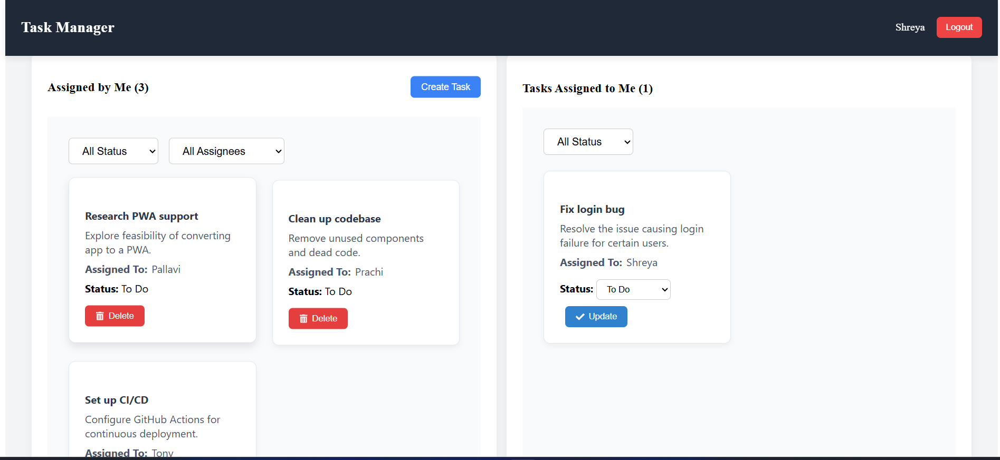

# Collaborative Task Manager (MERN Stack)

A simple collaborative task manager built using the MERN stack. Users can create tasks, assign them to team members, update status, and filter tasks.

## Features

- Create task with title, description, assignee, and status
- Update status (To Do, In Progress, Done)
- Filter tasks by status and assignee
- Delete tasks
- User authentication with JWT
- Separate views for tasks created by and assigned to the user


## Tech Stack

- **Frontend**: React.js (functional components with hooks)
- **Backend**: Node.js + Express.js
- **Database**: MongoDB (with Mongoose)
- **Styling**: CSS 
- **Version Control**: Git

---

## Authentication & Middleware

- User login/signup handled using JWT tokens
- Token is stored in localStorage for API auth
- Middleware protects task routes and verifies token


## Validations

- **Frontend**: Basic form checks on task creation, login, signup
- **Backend**: Mongoose schema validation ensures required fields
- **Middleware**: Rejects invalid/missing tokens for protected routes


## API Overview

- **User APIs**: Register and login endpoints that return a token on success.
- **Task APIs**: Create, fetch, update, and delete tasks. Token must be included in headers for these.
- **Filters**: Task fetching supports query-based filtering on status and assigned user.

---

## Run Locally
## Installation & Setup

### 1. Clone the Repository

```bash
git clone https://github.com/your-username/collaborative-task-manager.git
cd collaborative-task-manager

### Backend

```bash
cd BACKEND
npm install
node app.js

Create a .env file inside /backend with the following content:
ATLAS_URL=your_mongodb_connection_string
JWT_SECRET=your_secret_key

### FRONTEND

```bash
cd FRONTEND
npm install
npm run dev

##  API Documentation

### Authentication

- **Register:**  
  Send a POST request to `/user/register` with `username`,`email` and `password` in the body to create a new user account.

- **Login:**  
  Send a POST request to `/user/login` with valid credentials. Returns a JWT token on success. This token is required for accessing protected routes.

---

### Task Management

- **Create Task:**  
  Send a POST request to `/task` with `title`, `description`, `assignedTo`, and `status`. Only authenticated users can create tasks.

- **Get All Tasks:**  
  Send a GET request to `/task`. Returns all tasks that the user created or was assigned to. You can apply filters using query parameters like `status` or `assignedTo`.

- **Update Task Status:**  
  Send a PUT request to `/task/:id` with a new `status` in the request body. Only the assignee can update the task status.

- **Delete Task:**  
  Send a DELETE request to `/task/:id`. Only the user who created the task can delete it.

---

### Filtering

Tasks can be filtered using query parameters with the GET `/task` endpoint:

- `status` – Filter tasks by  (`To Do`, `In Progress`, `Done`)
- `assignedTo` – Filter tasks by assigned username

## Screenshots

### Login / Register Page


---

### 📝 Create Task Form


---

### 📋 Task List View (Grid Layout)


---


